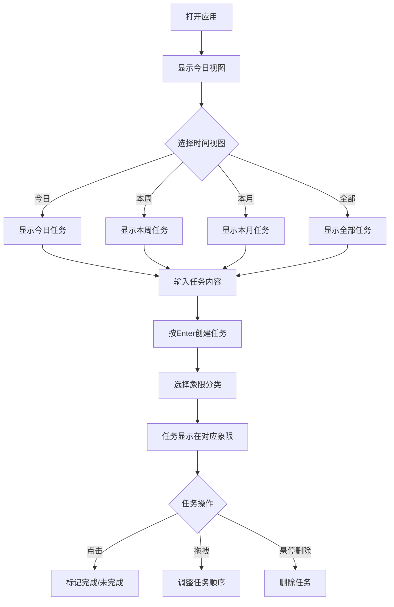

## 1. 产品概述
Zevi AI to-do是一款基于时间管理四象限法则的轻量级待办事项管理应用。通过本地存储实现数据持久化，无需联网即可使用，帮助用户高效管理个人任务，提升时间利用效率。

目标用户：需要个人任务管理的用户，特别适合注重时间管理、追求高效工作方式的职场人士和学生群体。核心价值：通过四象限分类法帮助用户聚焦重要任务，避免时间浪费在琐碎事务上。

## 2. 核心功能

### 2.1 用户角色
本产品为个人本地使用工具，无需用户注册登录，单用户模式使用。

### 2.2 功能模块
本工具包含以下核心页面：
1. **主页面**：四象限任务展示区域、时间视图切换、任务创建输入框、任务操作功能

### 2.3 页面详情
| 页面名称 | 模块名称 | 功能描述 |
|---------|---------|----------|
| 主页面 | 四象限展示区域 | 展示四个象限的任务卡片，每个象限显示任务标题、完成状态、创建时间，支持拖拽排序 |
| 主页面 | 时间视图切换 | 提供今日、本周、本月、全部四个时间维度的任务筛选，点击切换不同视图 |
| 主页面 | 任务创建输入框 | 单行文本输入框，支持回车键快速创建任务，自动分配到对应象限 |
| 主页面 | 任务操作功能 | 点击任务标记完成/未完成，悬停显示删除按钮，支持拖拽调整任务顺序 |

## 3. 核心流程
用户主要操作流程：
1. 打开应用后进入主页面，默认显示今日视图
2. 在顶部输入框输入任务内容，按Enter键创建任务
3. 选择任务所属象限（重要紧急、紧急不重要、重要不紧急、不重要不紧急）
4. 点击任务可快速标记完成状态，完成的任务显示删除线
5. 可通过时间视图切换查看不同时期的任务
6. 支持拖拽任务调整在四象限中的位置
7. 悬停任务显示删除按钮，可删除不需要的任务

## 4. 用户界面设计

### 4.1 设计风格
- **主色调**：采用简洁的蓝白配色方案，重要紧急象限使用红色强调
- **按钮样式**：扁平化设计，圆角矩形，悬停有轻微阴影效果
- **字体**：使用系统默认字体，标题16px，正文14px，小字12px
- **布局风格**：采用经典的四象限矩阵布局，上方为时间视图切换栏，下方为四象限任务区域
- **图标风格**：使用简洁的线性图标，完成状态使用勾选图标

### 4.2 页面设计概述
| 页面名称 | 模块名称 | UI元素 |
|---------|---------|--------|
| 主页面 | 顶部导航栏 | 白色背景，包含应用标题和时间视图切换按钮组，按钮为浅灰色圆角矩形 |
| 主页面 | 任务输入区 | 顶部中央位置，白色输入框，占位符文字"输入任务，按Enter创建"，边框为浅灰色 |
| 主页面 | 四象限矩阵 | 2x2网格布局，每个象限有不同背景色：重要紧急(浅红)、紧急不重要(浅黄)、重要不紧急(浅蓝)、不重要不紧急(浅灰) |
| 主页面 | 任务卡片 | 白色卡片，圆角设计，包含任务文本、创建时间、完成状态图标，悬停显示删除按钮 |

### 4.3 响应式设计
采用桌面优先设计，主界面在1200px以上宽度显示最佳效果。支持平板和手机端自适应，移动端采用垂直滚动布局，四象限在窄屏下变为垂直排列。

### 4.4 交互细节
- 任务创建时提供轻微的上浮动画效果
- 任务完成状态切换有0.3秒的过渡动画
- 拖拽排序时有明显的视觉反馈，拖拽项半透明，目标位置显示虚线框
- 删除操作有确认提示，避免误操作