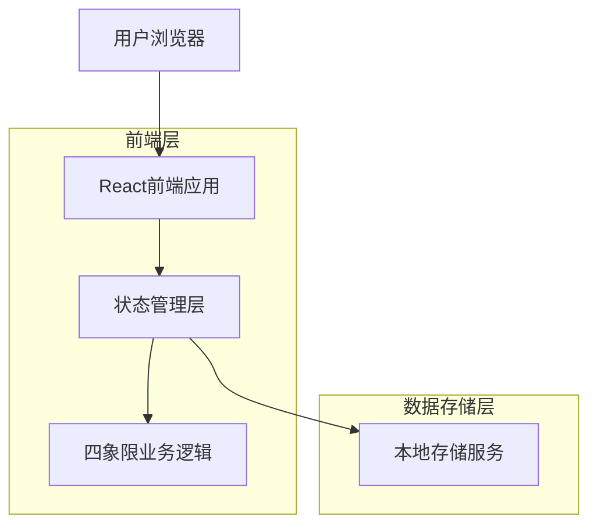
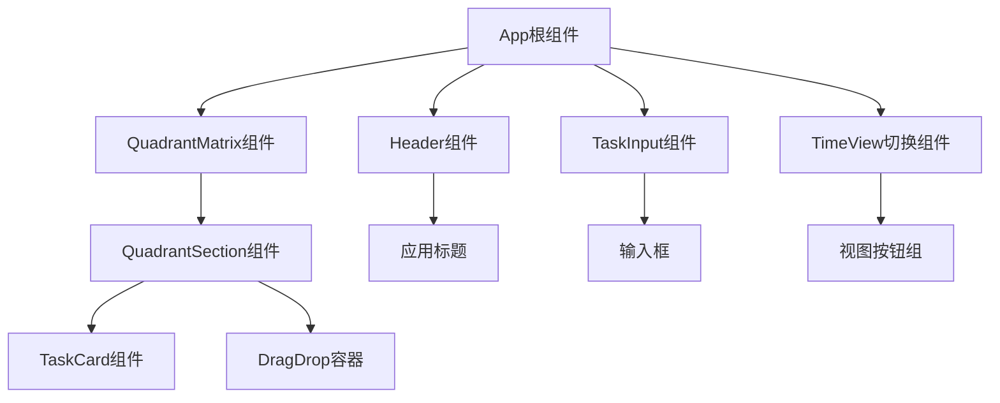

## 1. 架构设计



## 2. 技术描述

- **前端框架**：React@18 + TypeScript@5
- **构建工具**：Vite@5（快速构建和热更新）
- **样式方案**：TailwindCSS@3（原子化CSS，快速开发）
- **状态管理**：React Hooks（useState, useEffect, useContext）
- **拖拽功能**：HTML5 Drag and Drop API
- **数据存储**：浏览器LocalStorage API
- **初始化工具**：vite-init
- **后端**：无（纯前端应用）

## 3. 路由定义

| 路由 | 用途 |
|------|------|
| / | 主页面，Zevi AI to-do核心功能 |

## 4. 数据模型

### 4.1 核心数据类型定义

```typescript
// 任务优先级枚举
type Priority = 'urgent-important' | 'urgent-not-important' | 'not-urgent-important' | 'not-urgent-not-important';

// 任务状态枚举
type TaskStatus = 'pending' | 'completed';

// 时间视图枚举
type TimeView = 'today' | 'week' | 'month' | 'all';

// 任务接口定义
interface Task {
  id: string;                    // 唯一标识符
  content: string;                // 任务内容（一句话）
  priority: Priority;            // 四象限分类
  status: TaskStatus;             // 任务状态
  createdAt: number;              // 创建时间戳
  completedAt?: number;           // 完成时间戳（可选）
  order: number;                  // 排序权重
}

// 应用状态接口
interface AppState {
  tasks: Task[];                  // 所有任务列表
  currentView: TimeView;          // 当前时间视图
  isLoading: boolean;             // 加载状态
}
```

### 4.2 本地存储结构

```typescript
// LocalStorage键名定义
const STORAGE_KEYS = {
  TASKS: 'quadrant-todo-tasks',           // 任务数据
  SETTINGS: 'quadrant-todo-settings',     // 用户设置
  VIEW_PREFERENCES: 'quadrant-todo-view' // 视图偏好
};

// 存储数据结构
interface StorageData {
  tasks: Task[];
  lastSyncTime: number;
  version: string;
}
```

## 5. 组件架构



## 6. 核心业务逻辑

### 6.1 任务管理模块
```typescript
class TaskManager {
  // 创建任务
  createTask(content: string, priority: Priority): Task;
  
  // 更新任务状态
  toggleTaskStatus(taskId: string): void;
  
  // 删除任务
  deleteTask(taskId: string): void;
  
  // 拖拽排序
  reorderTasks(sourceId: string, targetId: string): void;
  
  // 按时间视图筛选
  filterTasksByTimeView(tasks: Task[], view: TimeView): Task[];
  
  // 按四象限分组
  groupTasksByQuadrant(tasks: Task[]): Record<Priority, Task[]>;
}
```

### 6.2 本地存储服务
```typescript
class LocalStorageService {
  // 保存任务数据
  saveTasks(tasks: Task[]): void;
  
  // 加载任务数据
  loadTasks(): Task[];
  
  // 备份数据
  backupData(): void;
  
  // 数据迁移
  migrateData(): void;
  
  // 存储空间检查
  checkStorageQuota(): number;
}
```

## 7. 性能优化策略

### 7.1 渲染优化
- 使用React.memo优化组件重渲染
- 实现虚拟滚动处理大量任务
- 使用useCallback缓存事件处理函数

### 7.2 存储优化
- 实现数据压缩减少存储空间
- 定期清理已完成的历史任务
- 使用IndexedDB作为大数据量的备选方案

### 7.3 交互优化
- 防抖处理输入事件
- 节流处理拖拽事件
- 异步处理复杂计算

## 8. 错误处理

### 8.1 存储错误处理
```typescript
interface ErrorHandler {
  // LocalStorage不可用时的降级处理
  handleStorageError(error: Error): void;
  
  // 数据损坏时的恢复机制
  handleDataCorruption(): void;
  
  // 存储空间不足的处理
  handleStorageQuotaExceeded(): void;
}
```

### 8.2 用户操作错误处理
- 输入验证和错误提示
- 拖拽操作的边界检查
- 删除操作的双重确认

## 9. 浏览器兼容性

- **现代浏览器**：Chrome 90+, Firefox 88+, Safari 14+, Edge 90+
- **移动端浏览器**：iOS Safari 14+, Chrome Mobile 90+
- **Polyfill**：为旧版浏览器提供必要的polyfill支持
- **渐进增强**：基础功能在所有浏览器可用，高级功能在现代浏览器启用